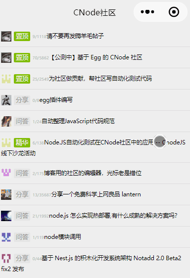

# mpvue-cnode
> 基于mpvue实现的cnode社区demo，功能逐步完善中..

## 预览



## 本地运行

```
 # 切换到项目目录
 cd project-name

 # 安装依赖
 npm i

 # 启动脚本
 npm run dev
```

然后用微信开发者工具打开本项目根目录即可。

## 代码提交

使用 [commitlint](https://github.com/marionebl/commitlint) + [husky](https://github.com/typicode/husky) 进行commit检查

使用 [commitizen](https://github.com/commitizen/cz-cli) 生成提交信息(需要全局安装)

## 其它脚本

* `npm run lint`: eslint 检查, 会根据 .eslintrc 的配置去检查 `src` 目录下的 `.vue` 和 `.js` 文件. 项目中加入了 `pre-push hooks`, 每次 `push` 之前都会自动运行该脚本. 可以参考 [doc](http://eslint.org/docs/rules/) 自定义配置.
* `npm run fix`: eslint 自动修复
* `npm run build`: 生产环境 build
