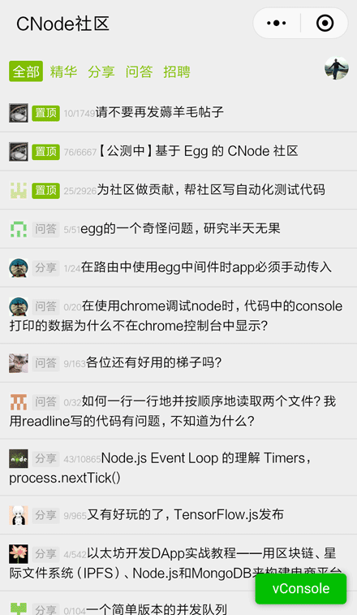

# mpvue-cnode
 > 基于mpvue实现的cnode社区demo

 > 社区类目没有开放给个人开发者，所以没能上线。

## 预览

 

## 本地运行

``` bash
 # 克隆仓库
 git clone git@github.com:bowencool/mpvue-cnode.git

 # 在`project.config.json`下修改你的`appid`

 # 将`https://cnodejs.org`添加到request合法域名列表

 # 切换到项目目录
 cd mpvue-cnode

 # 安装依赖
 npm i

 # 启动脚本
 npm run dev

 # 然后用微信开发者工具打开本项目根目录即可。
```
## 其它脚本

```bash
# eslint 检查
npm run lint

# eslint 自动修复
npm run fix

# 生产环境 build
npm run build
```
